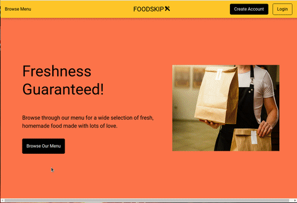
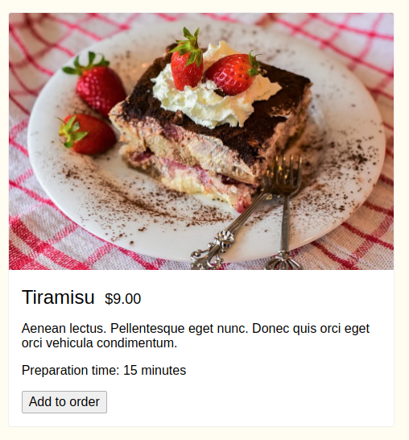
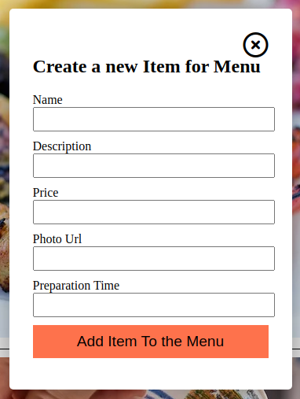
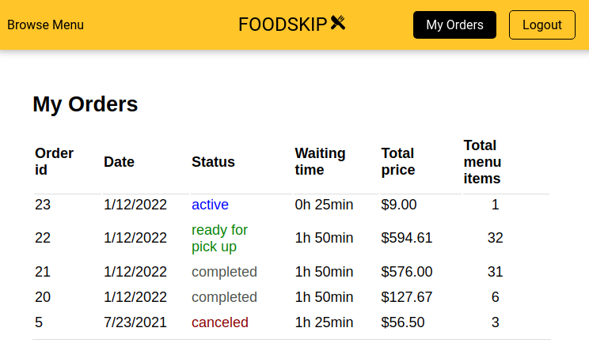

<h1 align="center">
   

   
  FOODSKIP
</h1>
<h3 align="center">Easy and reliable food pick-up ordering service</h3>

  
  
  
  

## Description

A food pick-up service ordering app built with Node.js, Express and JQuery, using PostgreSQL for development database. The app serves as an intermediary between the restaurant and client and integrates Twilio API for SMS notifications.

## Key Features

User:

- Browse menu and orders
- Order food
- SMS notifications

Restaurant:

- CRUD for restaurant menu
- Update order status
- SMS notifications

## Project Screenshots

  

 

  
  
  

 

  

## Getting Started

Follow these steps after setting up a local PostgreSQL database:

1. Create the `.env` by using `.env.example` as a reference: `cp .env.example .env`
2. Update the .env file with your correct local information
3. Install dependencies: `npm i`
4. Fix to binaries for sass: `npm rebuild node-sass`
5. Reset database: `npm run db:reset`

6. Run the server: `npm run local`

- Note: nodemon is used, so you should not have to restart your server

7. Visit `http://localhost:8080/`

## Dependencies

- node 10.x or above
- npm 5.x or above
- pg 6.x
- express
- cookie-session
- pg-native
- pg-promise
- sass
- twilio

## Future Improvements

- Registration and login
- User profile page
- Cancelling order
